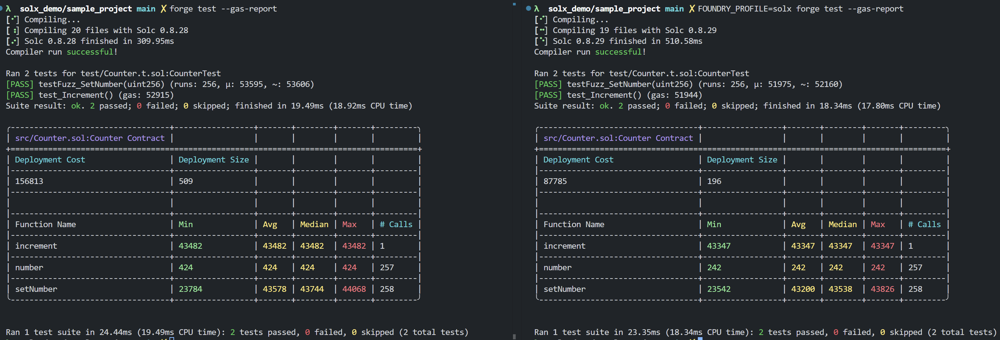
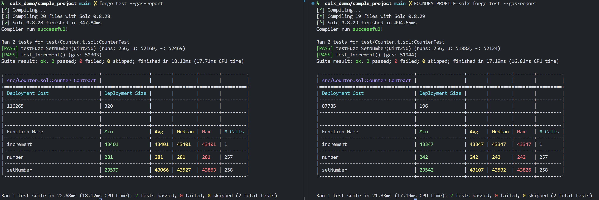
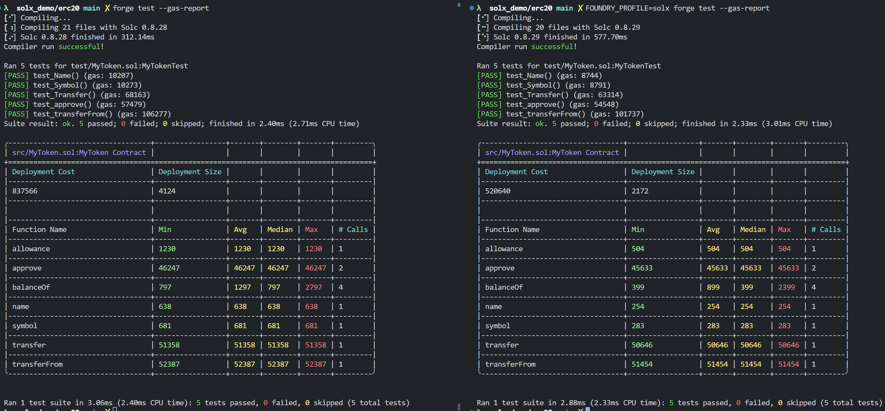
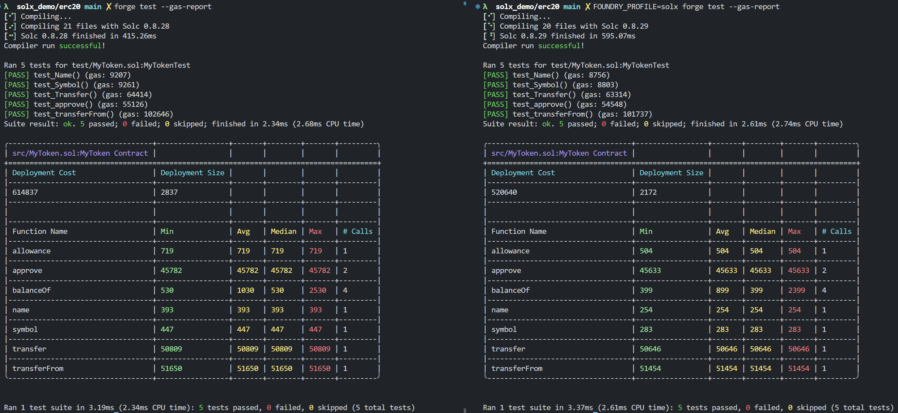
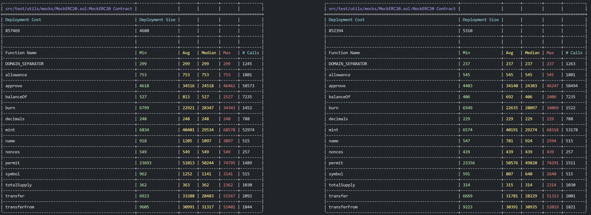
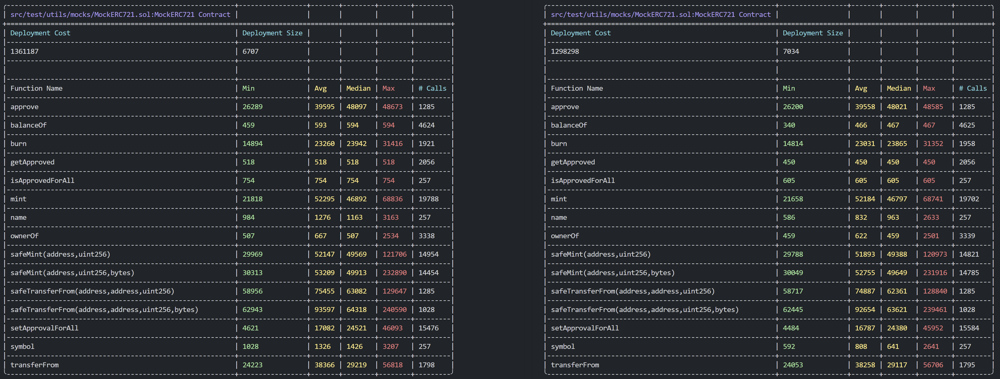
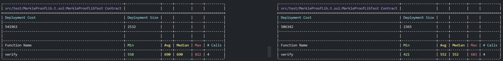
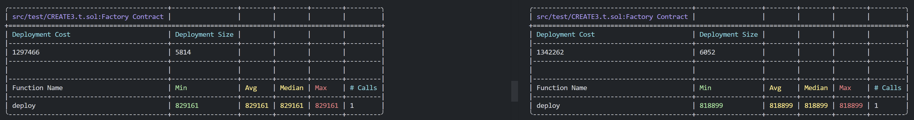

# `solx` compiler demo

This repository contains a playground to test `solx` capabilities.

> [!WARNING]  
> `solx` is in pre-alpha state and not suitable for production use.

## Installing

Here are the URLs for the test builds:

- [Linux/AMD64](https://github.com/matter-labs/solx/releases/download/eb46690/solx-linux-amd64-gnu-test-build-06)
- [Linux/Arm64](https://github.com/matter-labs/solx/releases/download/eb46690/solx-linux-arm64-gnu-test-build-06)
- [MacOS](https://github.com/matter-labs/solx/releases/download/eb46690/solx-macosx-test-build-06)

Choose the appropriate URL, download it to current folder, and make it executable, e.g.:

```bash
wget https://github.com/matter-labs/solx/releases/download/eb46690/solx-linux-amd64-gnu-test-build-06 -O solx
chmod +x solx
```

## Using with forge

By default, all the projects will use native `solc` 0.8.28, to compile with `solx` use `FOUNDRY_PROFILE=solx`, e.g.:

```bash
FOUNDRY_PROFILE=solx forge build
FOUNDRY_PROFILE=solx forge test
```

Or you can do `export FOUNDRY_PROFILE=solx` to make it used by default within your terminal session.

Please check which version is used for compilation: `0.8.28` corresponds to native `solc`, while `0.8.29` corresponds to `solx`.
The main reason to use different versions of compiler is to force foundry to recompile contracts when switching profiles.
`0.8.29` release of `solc` doesn't seem to have new optimizations, so it shouldn't affect comparisons. Feel free to compare
with other versions yourself.

`solx` is still very early in development. Here are some guidelines:

- Run `forge build` before running tests, and run `forge clean` after running tests. Re-compilation of already built contracts may not work as expected.
- `stack too deep` and `bytecode size is too big` errors may be very frequent; the work on optimizations required to prevent that is ongoing.
- Only `forge build` & `forge test` were checked; `forge script` and other options may not work or work incorrectly.

## Project structure

All the projects are configured to be using `solx` and will assume that it's present in the root of the repository.

- `sample_project`: a default `forge` project.
- `erc20`: sample ERC20 token using [`solady`](https://github.com/Vectorized/solady) library.
- `solmate`: copy of [`solmate`](https://github.com/transmissions11/solmate/) project, with compiler changed to `solc` 0.8.28 (for equivalence of benchmarks)
  and pragma limitations lifted. ⚠️ requires foundry v0.3.0 to work (project not compatible with v1.0.0 yet).

## Comparisons

There comparisons aren't meant to be considered proper benchmarks. Consider these comparisons to be "out-of-box", e.g. something
user will get with default settings for both compilers. Do your own research, and compare compiler performance for your
use case.

Additionally, consider that `solx` is still in a pre-alpha stage and many optimizations are not implemented yet!

In all the benchmarks, `solc` is on the left, `solx` is on the right.

### Sample project, no optimizations



### Sample project, 20000 optimizer runs



### ERC20, no optimizations



### ERC20, 20000 optimizer runs



### `solmate`

⚠️ Don't forget to install `foundry` 0.3.0 to run tests.

`solmate` has a lot of tests, so we provide only a subset here. Run it yourself 😅









